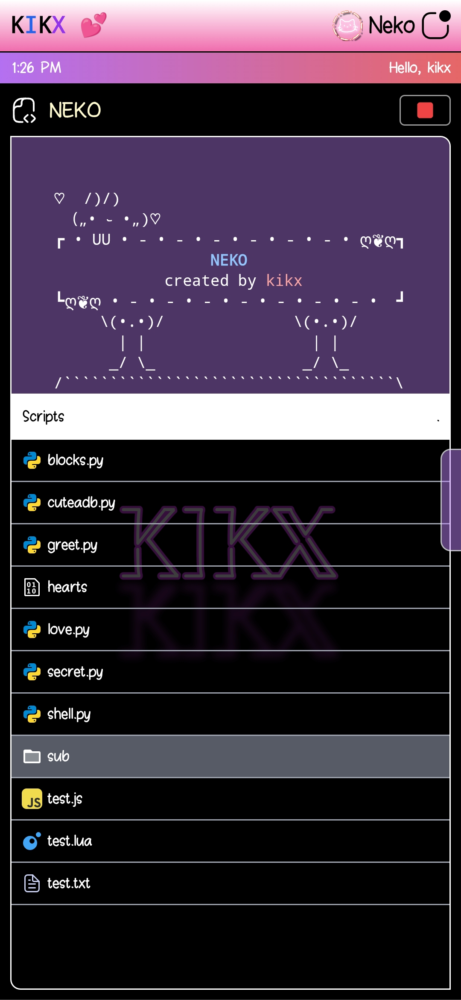

# Kikx

**Kikx** is a lightweight, web-based virtual operating system framework built using modern web technologies for the frontend and Python as the backend. It provides a simulated OS-like interface where Python scripts can be executed directly through the browser. Think of it as a customizable digital workspace or sandbox for running Python logic with a desktop-style UI.




---

## ✨ Features

- 🖥️ Virtual OS-like interface in the browser  
- ⚡ FastAPI backend for high-performance Python scripting  
- 🧠 Runs Python scripts dynamically via backend  
- 🌐 Frontend built using HTML, jQuery, and TailwindCSS  
- 🔌 Easily extendable and modular design  
- 💻 Great for demos, coding sandboxes, or embedded tools  

---

## 🚀 Technologies Used

- **Backend:** Python 3, FastAPI  
- **Frontend:** HTML, jQuery, TailwindCSS  
- **Other tools:** `venv`, Makefile

---

## ⚙️ Installation & Setup

Make sure Python 3.8+ is installed.

```bash
# Create a virtual environment
make venv

# Install dependencies
make install

# Start the server
make serve
