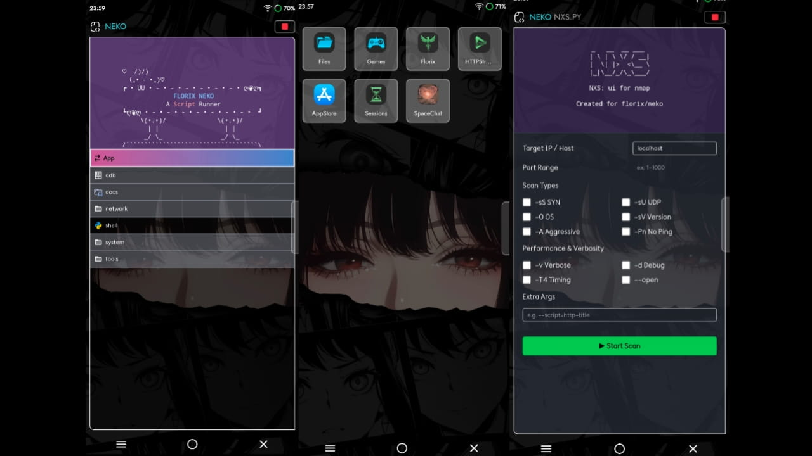
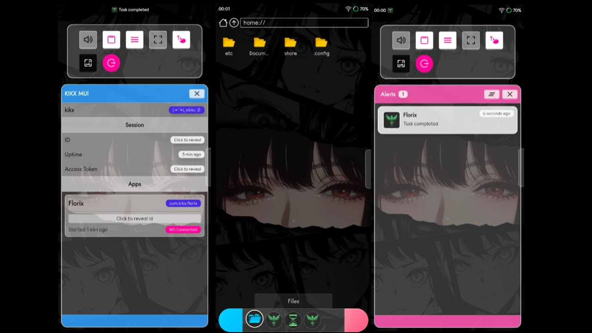
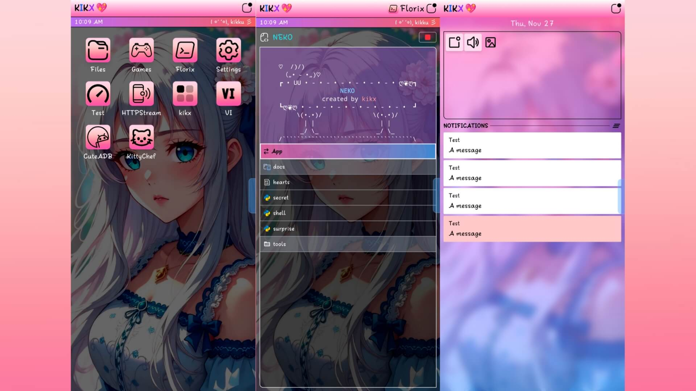

# KIKX-Project

⚠️ Note: KIKX is currently under active development. Features may change, break, or be incomplete as the project evolves.


## 🚀 Overview

**Kikx** is a web-based virtual operating system server built with modern frontend technologies and a Python-powered backend.

It acts as an application runtime environment where apps (built using HTML, CSS, and JavaScript) run inside isolated iframes, while the Kikx UI connects as a client to manage and launch them.

## 🌟 Screenshots

### MUI (default)



### KUI (old)


---

## 🏗️ Architecture

Kikx provides a service-oriented backend architecture powered by **FastAPI**.  
Apps communicate securely with the server through structured services such as:

- **fs** – File system operations  
- **system** – System-level interactions  
- **proxy** – External request handling  

These services are implemented using FastAPI `APIRouter` modules for modularity and scalability.

---

## 🧩 Server-Side Modules

Apps can also use server-side modules, such as a **tasks module**, which allows them to execute Python functions exposed using decorators (e.g., `@func`).

Through this system, apps can:

- Call backend Python functions  
- Run scripts dynamically  
- Execute long-running tasks  
- Receive real-time output via WebSockets  

---

## ✨ Features

- 🖥️ Virtual OS-like interface in the browser  
- ⚡ FastAPI backend for high-performance Python scripting  
- 🧠 Runs Web Apps using ui with fs, system, proxy services
- 🌐 Frontend (KUI) built using HTML, jQuery and TailwindCSS 
- ✨ Frontend (MUI) built using Vue, TailwindCSS and DaisyUI
- 🔌 Easily extendable and modular design

---

## 🚀 Technologies Used

- **Backend:** Python 3, FastAPI  
- **Frontend:** Vue, TailwindCSS, DaisyUI, HTML, CSS, jQuery

---

## ⚙️ Installation & Setup

Make sure Python 3.8+ is installed and make.

```bash
# Simply run
make

# OR

# Create a virtual environment
make venv

# Install dependencies
make install

# Start the server
make run
```

---

## 🛣️ Roadmap / TODO
Kikx is actively evolving. Below are planned features and improvements

### (MUI) App Features
- App redirects
- App popups
- KLand for apps
- Split screen support
- Settings for full customizations
- Drag and drop support

### 📦 App Manager
- Install / uninstall virtual apps
- Enable / disable apps
- Manage app permissions
- App sandboxing support
- Sudo permissions for app

### 🏬 App Store
- App marketplace
- Install apps with one click
- Version management & updates
- Community app publishing system

### 📂 File Manager (Vue-based)
- Build a modern file manager using Vue
- File system navigation (folders, breadcrumbs)
- File upload & download support
- Create, rename, delete files/folders
- Code editor integration

### 👨‍💻 New Desktop UI
- Desktop UI Support

### 😮‍💨 Cleaning & Tests
- Clean code optimizations
- Tests
- Docs

---

## 🔗 Related Projects

- [KIKX-APP-SDK](https://github.com/luvbyte/kikx-sdk)
- [KIKX-MUI](https://github.com/luvbyte/kikx-mui)

## License

This project is licensed under the Apache License 2.0 - see the LICENSE file for details.
