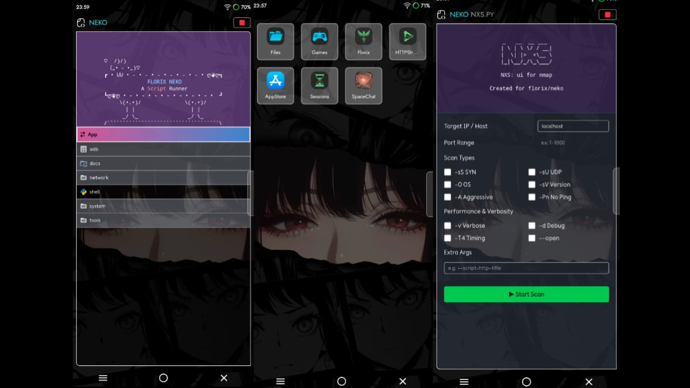
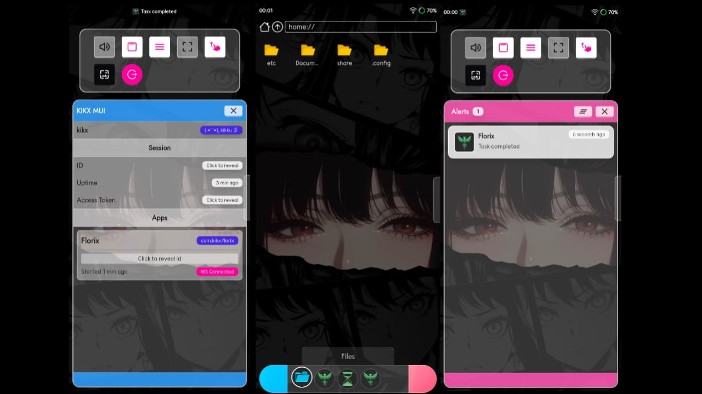

# KIKX-Project

⚠️ Note: KIKX is currently under active development. Features may change, break, or be incomplete as the project evolves.


## 🚀 Overview

**Kikx** is as an application runtime environment where apps (built using HTML, CSS, and JavaScript) run inside isolated iframes, while the Kikx UI connects as a client to manage and launch them.

## 🌟 Screenshots

### MUI (default)



---

## ⚙️ Installation & Setup

Make sure Python 3.8+ is installed and make.

```bash

# close repo
git clone https://github.com/luvbyte/kikx.git

cd kikx

# Setup (creates venv & fs)
make setup

# Start
make run

```

---

## ✨ Features

- 🖥️ Virtual OS-like interface in the browser  
- ⚡ FastAPI backend for high-performance Python scripting  
- ✨ Frontend (MUI) built using Vue, TailwindCSS and DaisyUI

---

## 🚀 Technologies Used

- **Backend:** Python 3, FastAPI  
- **Frontend:** Vue, TailwindCSS, DaisyUI

---

## 🔗 Related Projects

- [KIKX-DOCS](https://github.com/luvbyte/kikx-docs)
- [KIKX-APP-SDK](https://github.com/luvbyte/kikx-sdk)
- [KIKX-MUI](https://github.com/luvbyte/kikx-mui)

## License

This project is licensed under the Apache License 2.0 - see the LICENSE file for details.
